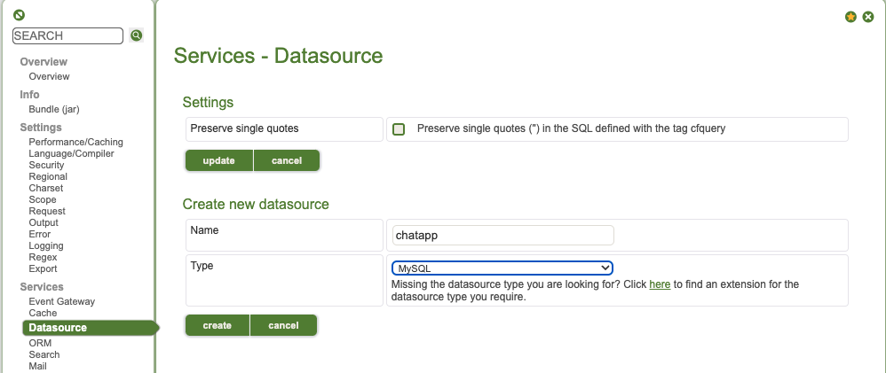
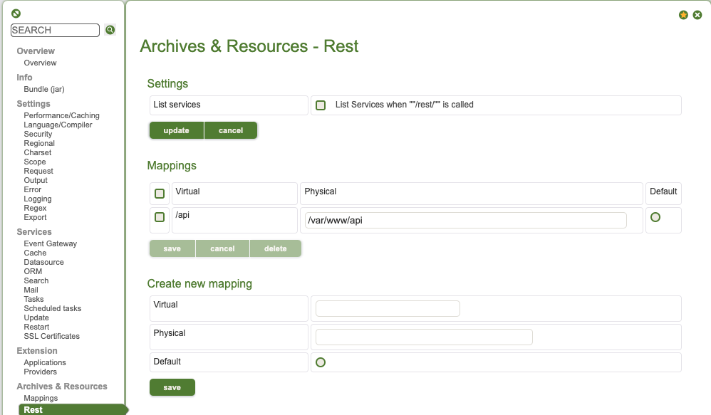
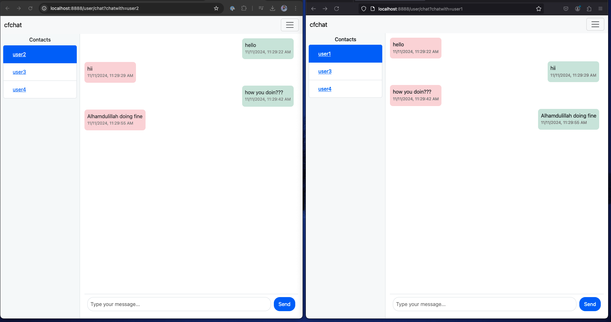
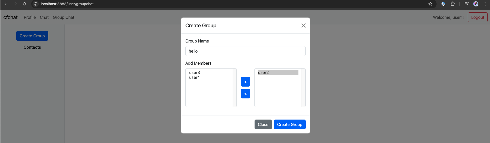
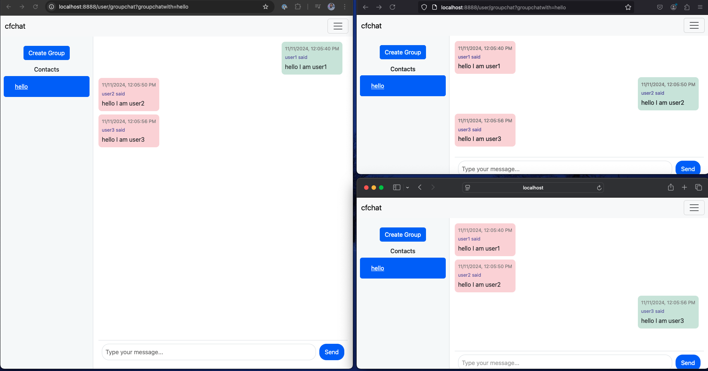

# cf-chat-app
A prototype chat app implementation using ColdFusion and WebSocket extension.

## Technologies

* **Lucee** for CFML engine [link](https://www.lucee.org/)
* **WebSocket Extension** for websocket connection [link](https://github.com/isapir/lucee-websocket)
* **MariaDB** for database service [link](https://mariadb.org/)

### Note

Before proceeding you should have a `URL Rewrite` enabled `lucee` server. Please refer to this [aba-wtag/Custom_Lucee](https://github.com/aba-wtag/Custom_Lucee) for a custom server.

## How to run

* First, clone this [repository](https://github.com/aba-wtag/lucee-mariadb-starter). This repository contains `Dockerfile` and `compose.yml` that is crucial for running the project.

  ```bash
  git clone https://github.com/aba-wtag/lucee-mariadb-starter.git
  ```

* After cloning `lucee-mariadb-starter` repository. Get inside `lucee-mariadb-starter` directory and again clone this [cf-chat-app](https://github.com/aba-wtag/cf-chat-app).

  ```bash
  cd lucee-mariadb-starter
  git clone https://github.com/aba-wtag/cf-chat-app.git
  ```

* In the `compose.yml` update like below and save.

  ```dockerfile
  services:
    database:
      image: mariadb:latest
      restart: always
      networks:
        - app-network
      environment:
        MARIADB_ROOT_PASSWORD: "hello"
        MARIADB_DATABASE: "chatapp"
      volumes:
        - ./db-data:/var/lib/mysql
        - ./cf-chat-app/DB_CHATAPP.sql:/docker-entrypoint-initdb.d/dump.sql
      ports:
        - "3306:3306"  # Expose MariaDB on port 3306
  
    lucee:
      build: .
      networks:
        - app-network
      environment:
        LUCEE_ADMIN_PASSWORD: "hello"
        LUCEE_EXTENSIONS: "3F9DFF32-B555-449D-B0EB5DB723044045"
      volumes:
        - ./cf-chat-app:/var/www
      ports:
        - "8888:8888"  # Expose Lucee on port 8888
  
  networks:
    app-network:
      driver: bridge
  ```

* Run the project from `lucee-mariadb-starter` directory by firing the below command.

  ```bash
  docker compose up
  ```

* After running visit the `localhost:8888/lucee/admin/server.cfm`  and login with `hello`.

* From the panel select `Datasource` and create a new datasource name `chatapp` and select the type `MySQL` and press `create`.

  

  * You will see a new panel opened. In that panel set `Host/Server` to `database`, `Username` to `root`, `Password` to `hello` and press on `create` again.

  * From the panel go to `Rest` update the fields in `Create new mapping` like below and save.

    

    * After following the above, go to the terminal where the `docker compose up` command was fired and stop the services using `Ctrl+C` or `Cmd+C`.
    * Lastly, again run `docker compose up` to restart the whole process again. Visit `localhost:8888` and enjoy the chat application.


# Features

## One-to-One Chat



## Create Group-Chat



## Group-Chat



## Directory Tree

```bash
.
├── Application.cfc
├── DB_CHATAPP.sql
├── README.md
├── WEB-INF
│   └── lucee
├── api
│   ├── GroupChat.cfc
│   └── chat.cfc
├── assets
│   └── css
│       └── chat.css
├── controllers
│   ├── chat
│   │   └── ChatListener.cfc
│   ├── login
│   │   └── login-controller.cfm
│   ├── logout
│   │   └── logout-controller.cfm
│   └── signup
│       └── signup-controller.cfm
├── db
│   ├── Chat.cfc
│   ├── GroupChat.cfc
│   ├── Login.cfc
│   └── Signup.cfc
├── lib
│   ├── Converter.cfc
│   ├── Helper.cfc
│   └── Router.cfc
├── routes.cfc
└── views
    ├── 404.cfm
    ├── admin
    │   └── admin.cfm
    ├── index.cfm
    ├── login.cfm
    ├── partials
    │   ├── footer.cfm
    │   └── header.cfm
    ├── signup.cfm
    └── user
        ├── group-chat
        │   ├── groupChatHandler.js
        │   └── groupchat.cfm
        ├── single-chat
        │   ├── chat.cfm
        │   └── chatHandler.js
        └── user.cfm

19 directories, 30 files
```

